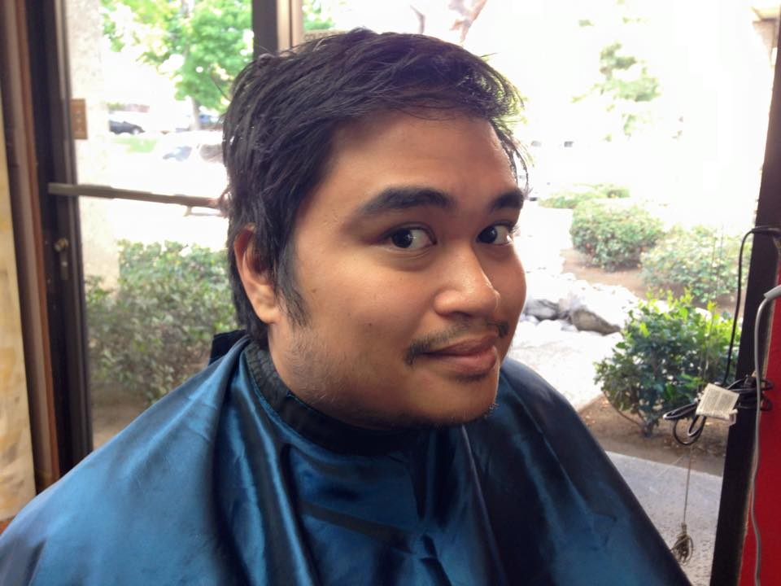

{:.avatar}

#James Calleja
Computer Science Student and Technology aficionado

<a href="mailto:">jcalleja@gmail.com</a>
|
<i class="fa fa-github"></i> <a href="http://github.com/">jcalleja</a>
|
<i class="fa fa-twitter"></i> <a href="http://twitter.com/">mytwitteraccount</a>

## Currently

Jobless!

## Education

`2005-2010`
__University of California, Riverside__ Bachelor's degree in English

## Technical skills

* HTML and CSS
* Javascript

## Projects

### CV

I created a this web page to show off my CV.  

## Achievements

Achievement 1

Achievement 2

## Experience

`2011-2016`
__Citrus Research Board__ 
Worked as a lab assistant

## Hobbies

* Hiking
* Riding 
* Cooking

## Links

* <i class="fa fa-envelope"></i> <a href="mailto:">jcalleja@gmail.com</a> 
* <i class="fa fa-github"></i> <a href="http://github.com/">jcalleja</a> 
* <i class="fa fa-twitter"></i> <a href="http://twitter.com/">mytwitteraccount</a> 
* <i class="fa fa-stack-overflow"></i> <a href="http://stackoverflow.com/">SO Account</a>
* <i class="fa fa-google"></i> <a href="http://scholar.google.com/">scholar</a>
