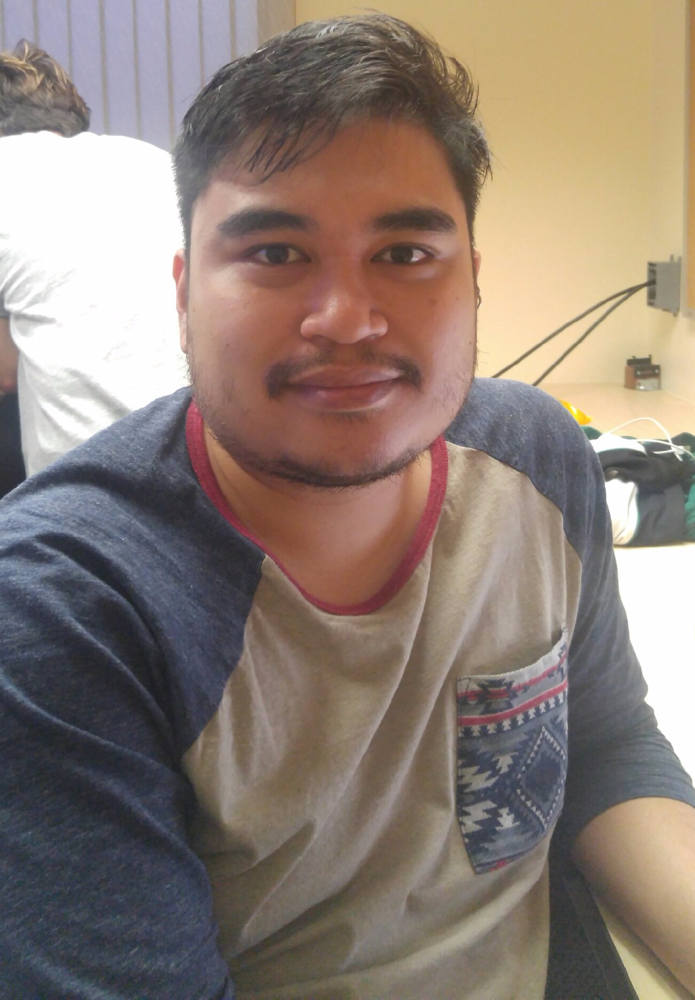

{:.avatar}

# James Calleja
Computer Science Student

<a href="mailto:">jcalleja@gmail.com</a>
|
<i class="fa fa-github"></i> <a href="http://github.com/jcalleja">jcalleja</a>
|
<i class="fa fa-twitter"></i> <a href="http://twitter.com/nouveau_nue">My Twitter</a>

## Currently

I am attending a 12 week bootcamp with SoftStack Factory in designing hybrid mobile and web apps. 
As of now, I am currently applying the MEAN stack development skills I learned through Soft Stack Factory 
and in process of incorporating a backend to the Ride Sharing project.
 

## Education

`2005-2010`
__University of California, Riverside__ B.A. in English

## Technical skills

* HTML and CSS
* Javascript
* MongoDB
* Express
* AngularJS
* Node

## Projects

### Rideshare! by SSF

I am working with SSF in developing a car pooling application. We expect to have this app fully functioning in 6 weeks. I am given on the job training, walking through the development process step by step. 
As a team, we formukated mockups to propose to investors and recieved feedback. I am assigned tasks in creating html templates with css styling, using AngularJS to make the app interactive, and using services to communicate with the backend (sending/retrieving information). 
As I work on this project, I am reinforcing the lessons I have learned through Soft Stack Factory.

### D&D Character App

The D&D Character APP allows users to create their own character and roll dice. The key goals of this app is to aid the user by providing a simple and easy to use interface to facilitate a smoother gameplay experience. 
The user will be able to log into the app and obtain information in communication with MongoDB/Strongloop Loopback. The dice roller allows the user to use the type of die and modify the results as deemed necessary.
The dice roller will be incorporated with the gameplay experience, modifying data by applying the roll results. It is currently in development.

### Short Story

This pet project is currently in the planning stages. Short Story will be a website where authors can upload their short stories and users can read. This will be a creative space for experimentation and endless amount of entertainment for people who love to read.

## Achievements

*Can find solutions to complex problems and improve upon them.

*Multidisciplinary and capable of working through tasks with successful results.

*Helped prevent damage to citrus produce by detecting the presence of HLB in local communities.

*Contributed to creating the county standard for trap reading and quality control protocols.

## Experience

`2011-2016`
__Citrus Research Board / Cooperative Agricultural Support Services Authority__ 
 
Laboratory Aide

Responsibilities include: 
* Detecting the presence of Asian Citrus Psylid and report findings to a supervisor. 
* Sterilization and disposal of laboratory equipment and experiment samples on a demand basis. 
* Provide assistance with laboratory experiments (PCR/DNA Extraction) through insect loading and plant sample preparation.

## Hobbies

* Hiking
* Riding Bikes
* Cooking
* Tabletop Gaming
* Classic Gaming

## Links

* <i class="fa fa-envelope"></i> <a href="mailto:jcalleja@gmail.com">jcalleja@gmail.com</a> 
* <i class="fa fa-github"></i> <a href="http://github.com/jcalleja">My Github</a> 
* <i class="fa fa-twitter"></i> <a href="http://twitter.com/nouveau_nue">My Twitter</a> 
* <i class="fa fa-stack-overflow"></i> <a href="http://stackoverflow.com/">SO Account</a>
* <i class="fa fa-google"></i> <a href="http://scholar.google.com/">scholar</a>
